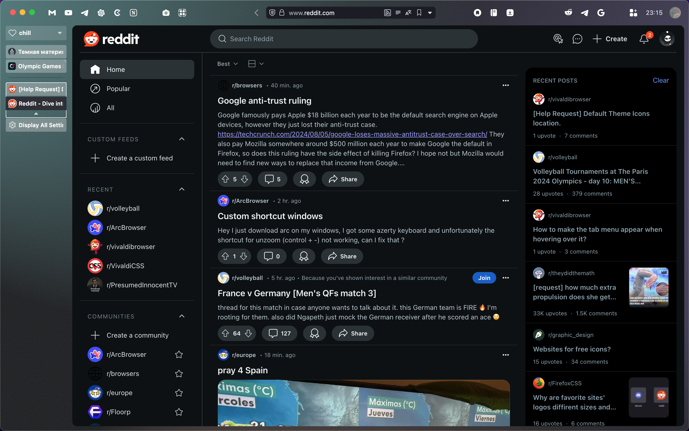
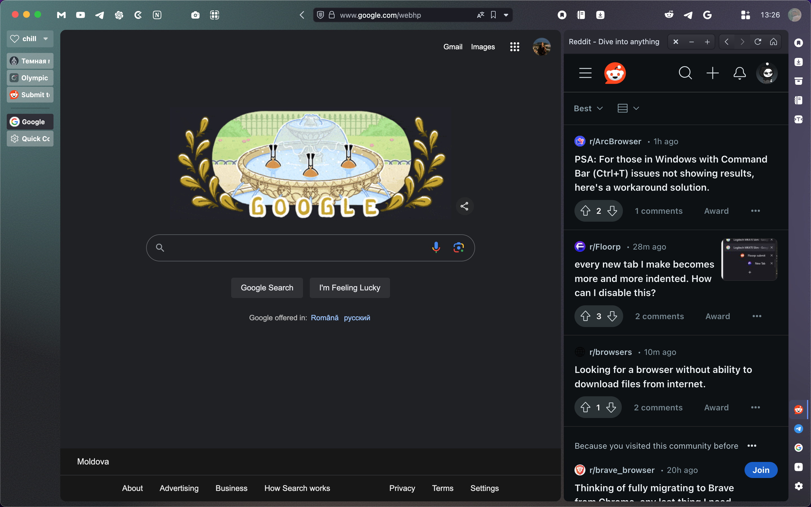
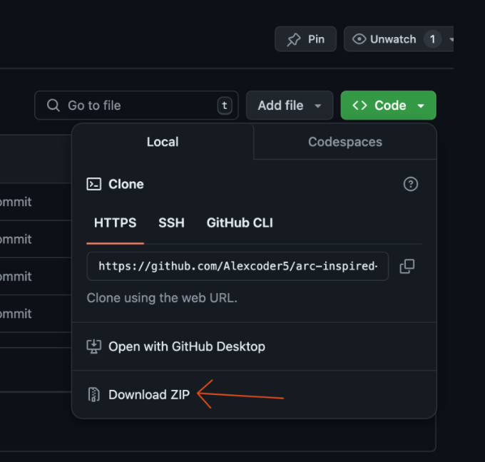
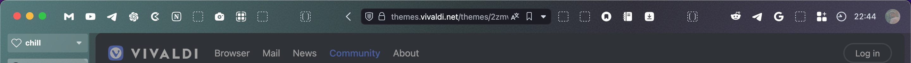

# Vivaldi11 theme

## Preview

    
    

## How to install

### Download this repo
* Press on Code
* Download ZIP

* Unarchive ZIP

### Adding Style to Vivaldi (CSS)
* Open ***vivaldi://experiments***
* Enable **"Allow for using CSS modifications"**.
* Open **Appearance** section in settings.
* Under **"Custom UI Modifications"** choose the unarhived folder you just downloades.
* IMPORTANT: The CSS files can't have spaces in the filename or they won't work. (in case you want to change it)
* Restart Vivaldi to see them in effect.

### Configuring Vivaldi in settings
* Appearance -> Dark
* Themes -> Editor -> Background -> From Vivaldi
* Themes -> Editor -> Settings -> Transparent Tab Bar
* Tabs -> Left
* Panel -> Right Side

* View -> Customize Toolbar -> Place anything you like here | Here's how I have it:

### To create a Bookmark Like icon and place it to a toolbar
* Settings -> Quick Commands -> Command Chains -> + (create) -> Command 1: Open link in New Tab -> Command Parameter: ***website link***
* Themes -> Editor -> Icons -> Find Your Command Chain (in the end) and upload an SVG for it. You can also change icons other toolbar/panel elements here
*  View -> Customize Toolbar -> Command Chains -> Find your Command and place it to any panel/toolbar you want. You can move all the elements accross address bar / status bar / panel

## Nice to have
* Go to setting -> Shortcuts and create shortcuts for toggling tab bar / panel and other elements you often use 
* You can permanently remove minimized panel (on right) by uncommenting this line in style.css. This way you'll have right panel icons only when you panel is open. 

<table>
<tr>
<td>
<pre>
.tab-position .svg-tab-stack {
    /* display: none!important */
}
</pre>
</td>
<td>
&rarr;
</td>
<td>
<pre>
.tab-position .svg-tab-stack {
    display: none!important
}
</pre>
</td>
</tr>
</table>

### If you find any bugs just post it under the `issues` in this project. I'll fix it when I have time.
### In case you want to thank me: https://www.buymeacoffee.com/alex_coder